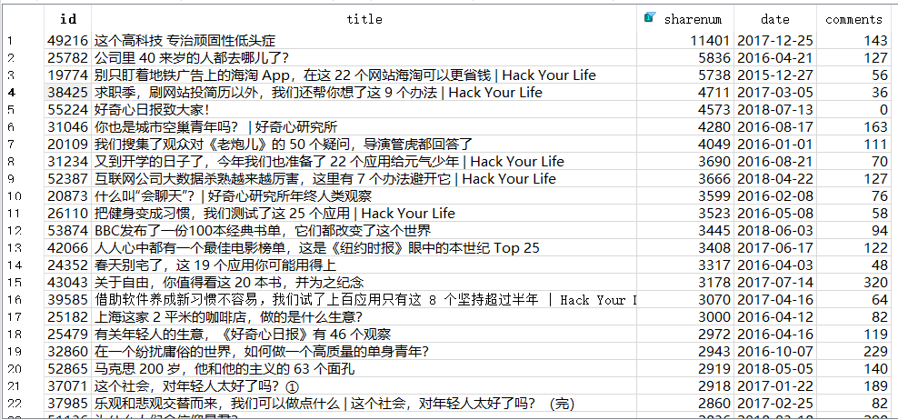
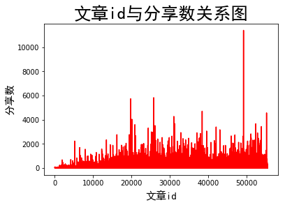

# 爬取好奇心日报
## 本项目最后更新于2018-7-24，可能会因为没有更新而失效。如已失效或需要修正，请提issue！
因为我是最近才关注好奇心日报的，感觉好奇心日报从14年创办以来许多的
好文章我都没看，所以打算找出这些好文章。  
一般来说一篇好文的分享数或者评论数都比较多，所以我只要爬下
好奇心日报的每篇文章的评论和分享数就行了。

## 准备工作
第一步是发现好奇心日报的文章地址编码是按数字递增的，例如：
http://www.qdaily.com/articles/38425.html
很快就可以发现标题，分享数，文章发布日期都在页面里，
但是评论数不在页面中  
然后我使用谷歌浏览器的F12的network功能，发现了评论
是通过json数据获得的，地址类似：
http://www.qdaily.com/comments/article/38425/0.json
然后爬虫写起来就比较容易了  
看到那么多评论，于是我顺便把评论的内容也爬下来了  
## 结果展示
先是根据文章分享数排序：    
    
然后评论的词云显示的结果：   
    
然后是文章id与分享数关系图：    
    
可以看出越到后面，平均每篇文章的分享数就越多，可以反映出好奇心日报的用户数变多  

## 代码
**爬虫代码在 [qdaily-spider](qdaily-spider.py)**  
**生成词云代码在 [qdaily-comment](qdaily-comment.py)**  
**生成文章id与分享数关系图的代码在 [qdaily-share](qdaily-share.py)**  

